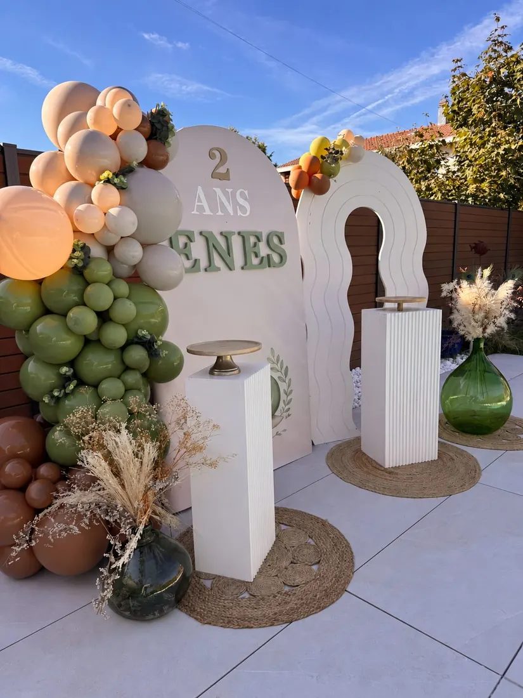

# jolie-creation.com

Site vitrine et boutique en ligne de Jolie Création : biscuits personnalisés
décorés à la main et micro-scénographies événementielles.

Site statique, sans étape de compilation. Les pages sont du HTML servi tel
quel ; seul le paiement passe par deux fonctions serverless.

---

## Activer le paiement en ligne (SumUp)

Le parcours panier → livraison ou retrait → paiement → confirmation est
en place et testé. Il ne manque que **les identifiants SumUp**. Tant
qu'ils ne sont pas renseignés, la page affiche un message honnête et
propose de finaliser par WhatsApp, par e-mail ou en choisissant le
retrait. Aucun faux paiement n'est simulé.

### 1. Récupérer les deux valeurs

| Où                                                          | Quoi                                     |
| ----------------------------------------------------------- | ---------------------------------------- |
| [Tableau de bord SumUp → Clés API](https://me.sumup.com/settings/api-keys) | La clé API, qui commence par `sup_sk_` |
| Profil du compte SumUp                                       | Le code marchand (*merchant code*)       |

### 2. Les renseigner dans Netlify

**Site settings → Environment variables → Add a variable**

| Nom                   | Valeur       |
| --------------------- | ------------ |
| `SUMUP_API_KEY`       | `sup_sk_...` |
| `SUMUP_MERCHANT_CODE` | le code marchand |

Puis redéployer le site pour que les fonctions voient les variables.

> La clé API ne doit jamais être écrite dans un fichier du dépôt, ni dans
> une page HTML, ni dans un fichier JavaScript. Elle permet d'encaisser
> des paiements : une clé publiée est une clé compromise, à révoquer
> immédiatement depuis le tableau de bord SumUp.

### 3. Vérifier

Passer une commande de bout en bout, dans les deux modes. Le retrait ne
déclenche aucun paiement : la commande doit arriver par e-mail (voir la
section suivante). La livraison doit en plus apparaître dans le tableau
de bord SumUp, avec la même référence `JC-AAAAMMJJ-XXXXXX`.

---

## Recevoir les demandes de devis et les commandes

Tout arrive par e-mail à **info@jolie-creation.com**, par le même
chemin :

```
formulaire → netlify/functions/envoyer-message.js → Nodemailer
           → SMTP Infomaniak → info@jolie-creation.com
```

Un seul chemin pour les deux : les demandes de devis (page Contact,
qu'on y arrive depuis une formule de micro-scénographie, une collection
ou directement) et les commandes de la boutique. Netlify Forms n'est pas
utilisé.

### Les variables à renseigner

**Site settings → Environment variables**, jamais dans le dépôt :

| Nom             | Valeur                                        |
| --------------- | --------------------------------------------- |
| `SMTP_USER`     | `info@jolie-creation.com`                     |
| `SMTP_PASSWORD` | le mot de passe de cette boîte                |
| `SMTP_HOST`     | `mail.infomaniak.com` *(valeur par défaut)*   |
| `SMTP_PORT`     | `465` *(valeur par défaut, SSL)*              |

`SMTP_HOST` et `SMTP_PORT` peuvent être omis : la fonction retient ces
valeurs. `SMTP_USER` et `SMTP_PASSWORD` sont obligatoires. Le port 465
chiffre d'emblée ; le port 587 bascule automatiquement sur STARTTLS.

> Infomaniak refuse d'expédier au nom d'une adresse qui n'appartient pas
> au compte authentifié. `SMTP_USER` doit donc bien être la boîte
> `info@jolie-creation.com`, qui est aussi l'adresse d'expédition.

Tant que ces variables manquent, le formulaire ne dit pas « merci » : il
annonce que l'envoi n'est pas activé et propose l'e-mail et WhatsApp. Un
« merci » affiché sur une demande perdue serait pire que l'absence de
formulaire.

### Ce que contient l'e-mail

Tous les champs remplis, dans un ordre lisible, plus l'image
d'inspiration en pièce jointe si le client en a joint une (3 Mo au
plus). Le champ **Répondre à** porte l'adresse du client : répondre à
l'e-mail lui répond directement.

La liste des champs transmis vit dans `envoyer-message.js`, constante
`CHAMPS`. Ajouter un champ au formulaire demande de l'ajouter là aussi,
sans quoi il n'est pas transmis. C'est volontaire : une liste ouverte
laisserait n'importe quoi entrer dans le courrier.

### Anti-spam

Trois filtres, du plus fiable au moins fiable :

1. **Un pot de miel**, champ invisible que seul un robot remplit. La
   demande est alors jetée, mais le robot reçoit « envoyé » : celui qui
   croit avoir réussi ne réessaie pas.
2. **Un délai de saisie minimum** de trois secondes.
3. **Une limite de cinq envois par adresse IP** sur dix minutes. Elle
   vit en mémoire, donc dans un seul conteneur : deux envois peuvent
   tomber sur deux conteneurs différents et y échapper. C'est un
   garde-fou contre l'envoi en rafale, pas une protection sérieuse. Si
   le spam devient un vrai problème, c'est un service dédié qu'il
   faudra brancher.

---

## Ce qui reste à faire avant l'ouverture de la boutique

- **Les modèles et les prix de la collection Automne.** La collection est
  publiée, illustrée de ses sept photos et mise en avant, mais sa liste de
  biscuits n'a pas encore été fournie. Tant que `produits` est vide dans
  `catalogue.js`, la carte annonce que les modèles arrivent et renvoie
  vers le devis : aucun prix n'est supposé. Remplir le tableau suffit à
  faire apparaître le bouton, la modale et l'achat, sans toucher à
  quoi que ce soit d'autre.
- **Conditions générales de vente.** Une boutique en ligne suisse doit
  les publier et y renvoyer depuis le tunnel de commande. Elles
  n'existent pas encore sur le site.
- **Frais de livraison.** Ils ne sont pas facturés en ligne : le site
  indique qu'ils sont confirmés séparément selon la destination.

---

## Structure

| Fichier / dossier                              | Rôle                                                        |
| ---------------------------------------------- | ----------------------------------------------------------- |
| `catalogue.js`                                 | Prix et articles achetables. Source unique, navigateur + serveur. |
| `boutique.js`                                  | Panier (localStorage), modale de sélection, minimum de 12 biscuits. |
| `panier.html`                                  | Récapitulatif, quantités, totaux.                            |
| `paiement.html`                                | Livraison ou retrait, coordonnées, puis départ vers SumUp.   |
| `commande-confirmee.html`                      | Relit l'état réel du paiement auprès de SumUp.               |
| `netlify/functions/create-checkout.js`         | Crée la session de paiement. Seul endroit où vit la clé.     |
| `netlify/functions/get-order.js`               | Relit l'état d'un paiement.                                  |
| `netlify/functions/envoyer-message.js`         | Envoie devis et commandes par e-mail. Seul endroit où vivent les identifiants SMTP. |
| `tests/catalogue.test.js`                      | Tests de la fonction de paiement (`npm test`).               |
| `tests/envoi.test.js`                          | Tests de la fonction d'envoi (`npm test`).                   |
| `outils-galerie.py`                            | Recompose en rangées les photos d'une micro-scénographie.    |
| `outils-collections.py`                        | Régénère le catalogue de « Mes réalisations » et l'aperçu de saison depuis `catalogue.js`. |
| `outils-photos.py`                             | Dérive les vues de galerie et les photos de carte, et convertit en WebP. |
| `images/collections/<id>/principale.webp`      | La grande photo de chaque collection.                        |
| `images/collections/<id>/vue-1.webp`…          | Les vues secondaires, dérivées des photos pleine taille.     |
| `images/collections/<id>/*.jpg`                | Les photos pleine taille d'origine, rangées avec leur collection. |
| `images/micro-scenographies/<thème>/`          | Les photos d'une micro-scénographie installée, originaux et WebP de carte. |
| `images/site/fond-rayures.png`                      | Les rayures du fond, seules.                                 |
| `images/site/filigrane-logo.webp`                   | Le médaillon du logo, en filigrane par-dessus les rayures.   |

### Trois principes du code de paiement

**Les prix ne viennent jamais du navigateur.** La page envoie des
identifiants d'articles et des quantités ; la fonction serveur relit les
montants dans `catalogue.js`. Un panier trafiqué dans la console ne peut pas
faire baisser la somme débitée.

**Les centimes ne deviennent des francs qu'au dernier moment.** Tout le
site compte en entiers (`7250`), SumUp attend des unités majeures
(`72.50`). La conversion a lieu une seule fois, dans `Catalogue.enFrancs`,
au bord de l'API. Additionner des francs en virgule flottante finit
toujours par produire un `72.49999999` quelque part.

**La commande et le paiement voyagent séparément.** SumUp ne transporte
qu'un montant : ni l'adresse, ni le détail des articles. La commande part
donc par e-mail *avant* le départ vers le paiement, sous la même
référence `JC-AAAAMMJJ-XXXXXX`. C'est elle qui fait le lien entre les deux
enregistrements. Si cet envoi échoue, le client n'est pas emmené vers le
paiement : encaisser une commande qui n'arriverait jamais serait pire que
de la refuser.

**Le minimum de douze biscuits porte sur le panier entier.** Chaque
biscuit se commande à l'unité, à son prix, et les collections se
mélangent librement : cinq Petit Océan et sept Rêve de Licorne font une
commande valable. La règle vit dans `JCPanier.blocage()`, le panier et la
page de paiement s'y réfèrent tous les deux, et la fonction serveur la
revérifie avant d'encaisser — c'est là que l'argent change de main.

---

## La photo d'une formule de micro-scénographie

Les trois cartes de `micro-scenographies.html` partagent le même cadre,
et chacune porte désormais sa photo :

```html
<div class="card-image">
  
</div>
```

Le cadre garde sa proportion de 4/5 à toutes les largeurs, donc le
cadrage est le même en une, deux ou trois colonnes.

**La carte sert un `.webp`, pas l'original.** Le cadre fait 341 px de
large : y télécharger un fichier de 1100 px coûterait trois fois la taille
utile. La table `FORMULES` en tête d'`outils-photos.py` liste les photos
concernées et écrit le `.webp` à côté de chacune :

```bash
python3 outils-photos.py
```

L'original ne bouge pas — la galerie de « Mes réalisations » et le partage
social continuent de s'en servir en pleine taille. Les trois cartes sont
ainsi passées de 754 ko à 235 ko, sans différence visible à l'écran.

**Chaque photo doit montrer ce que sa formule vend, et rien de plus.**
Les trois viennent du même événement, et c'est justement ce qui les rend
comparables : la Formule 1 montre le décor et ses présentoirs vides, la
Formule 2 les mêmes présentoirs garnis de biscuits, la Formule 3
l'ensemble avec le photobooth. Illustrer la Formule 1 avec une photo où
l'on voit des biscuits promettrait ce qu'elle ne comprend pas.

### Cadrer une photo sans la déformer

Les photos de l'atelier sont en portrait, les cadres des cartes sont plus
larges : il faut donc choisir ce qu'on garde. `object-fit: cover` s'en
charge sans jamais étirer l'image, et `object-position` décide de la
partie visible. Deux classes suffisent sur l'accueil :

| Classe            | Position          | Pour quoi                         |
| ----------------- | ----------------- | --------------------------------- |
| `cadrage-haut`    | `center 12%`      | Un décor dont le haut porte le sujet |
| `cadrage-tiers`   | `center 28%`      | Un présentoir, sujet au premier tiers |

Le pourcentage est le point de la photo qu'on veut voir au même point du
cadre : 0 % colle le haut de la photo au haut du cadre, 100 % le bas au
bas.

---

## Deux pages, deux rôles

**La séparation est la règle qui tient tout le reste.**

`biscuits-personnalises.html` **présente la prestation**. Ni modèle, ni
prix, ni bloc de collection. Sept sections :

1. **En-tête** — l'offre en une phrase, sans photo.
2. **Saison en cours** — un aperçu des collections `"saison": true` :
   photo, nom, lien vers la galerie. Rien d'autre.
3. **Comment sont créés mes biscuits ?** — les six étapes de l'atelier.
4. **Ingrédients & conservation** — composition, allergènes, durée.
5. **Mes réalisations** — la passerelle vers la galerie.
6. **Elles en parlent** — les avis clients. Ils vivent ici et nulle part
   ailleurs.
7. **Appel final** — devis et WhatsApp.

`mes-realisations.html` **porte le catalogue entier**. Les vingt-six
collections y vivent, et elles seules : grande photo, nom, présentation,
vues secondaires, nombre de modèles et bouton d'action. Puis la
micro-scénographie installée.

**Toute photo de biscuit appartient à une collection.** Il n'y a plus de
galerie séparée : une photo qui n'illustrait aucune collection en a reçu
une. Deux endroits qui montrent les mêmes biscuits finissent toujours par
diverger, et le visiteur ne sait plus lequel fait foi.

**Une collection sans prix se commande sur devis.** Son bloc n'ouvre pas
la modale : il renvoie au formulaire de contact, thème pré-rempli. Six
collections sont dans ce cas. `outils-collections.py` choisit le bouton
d'après `produits` : une liste vide veut dire devis.

**Les prix ne s'affichent nulle part sur la page.** Ils apparaissent dans
la modale, au moment de choisir ses biscuits. Une liste de tarifs sous
chaque collection transformait la galerie en catalogue e-commerce ; c'est
un portfolio.

Les deux zones se régénèrent d'un même geste :

```bash
python3 outils-collections.py
```

Le script écrit le catalogue dans « Mes réalisations » et l'aperçu de
saison dans la vitrine. Il ne peut pas écrire de prix du côté vitrine : c'est le
gabarit qui l'en empêche, pas la discipline.

### Les six étapes de l'atelier

Elles vivent en clair dans la page, dans `<ol class="atelier-etapes">`.
Deux d'entre elles n'ont pas encore de photo d'atelier : elles portent la
classe `atelier-etape-texte` et tiennent en une rangée compacte, numéro à
gauche. Un grand cadre vide vaudrait moins qu'une rangée assumée.

Le jour où la photo existe, rendre à l'étape son cadre et retirer la
classe :

```html
<li class="atelier-etape">
  <div class="atelier-photo">
    
  </div>
  <div class="atelier-texte">…</div>
</li>
```

Les photos des quatre autres étapes sont de vraies photos de l'atelier,
choisies parce qu'elles montrent l'étape : le biscuit nature avant
décoration, la poche à douille sur le plan de travail, un prénom
calligraphié, une commande emballée sachet par sachet.

---

## Modifier les photos d'une micro-scénographie

Les photos sont posées à plat dans le `<div class="folio-masonry">` de la
section « Micro-scénographies » de `mes-realisations.html` : une balise
`<figure class="folio-item">` par photo. Après tout ajout ou retrait,
relancer :

```bash
python3 outils-galerie.py
```

Le script relit les dimensions réelles des fichiers, regroupe les photos
en rangées et écrit le résultat dans la page. Chaque rangée occupe
exactement la largeur et toutes ses photos y ont la même hauteur, sans
aucun recadrage. Il est idempotent : le relancer deux fois donne le même
résultat.

Une section peut s'ouvrir sur une grande photo, comme celle des micro-
scénographies : un bloc `univers-layout` pour la photo principale et le
texte, puis un `folio-group` où chaque `folio-set` est une réalisation,
avec son titre, sa description et ses vues secondaires.

---

## Le fond du site

Le fond est empilé en trois couches par `body::before`, dans `styles.css` :
le voile crème, puis le médaillon du logo, puis les rayures.

Le médaillon est un fichier séparé, et non une incrustation dans l'image de
fond. Les rayures sont cadrées en `cover` : sur un écran étroit, l'image est
mise à l'échelle sur la hauteur de la fenêtre et déborde largement sur les
côtés. Un médaillon incrusté y serait rogné. En couche à part, sa taille se
calcule sur la fenêtre — `min(50vh, 78vw, 620px)` — et il reste entier de
320 px à 1920 px de large.

Pour changer la discrétion du filigrane, agir sur l'opacité du voile crème
(`rgba(252, 241, 235, 0.9)`) : elle atténue le médaillon en même temps que
les rayures. Le texte garde un contraste d'au moins 5,2 pour 1 sur le point
le plus sombre du médaillon, au-dessus du seuil d'accessibilité AA.

---

## Ajouter une collection de biscuits

Tout se passe dans `catalogue.js`, tableau `COLLECTIONS`. Un bloc suffit :

```js
{
  "id": "ma-collection",
  "nom": "Ma collection",
  "occasion": "Anniversaire",
  "description": "Une phrase ou deux, lisibles et utiles au référencement.",
  "alt": "Biscuits personnalisés thème …",
  "produits": [
    { "ref": "petit-modele", "nom": "Petit modèle", "prix": 500 },
    { "ref": "prenom", "nom": "Biscuit prénom", "prix": 650, "perso": ["prenom"] }
  ]
}
```

Puis créer le dossier `images/collections/ma-collection/`, y déposer la
grande photo sous le nom `principale.jpg` — avec les photos pleine taille
de la collection, s'il y en a — et lancer les deux outils :

```bash
python3 outils-photos.py        # principale.jpg devient principale.webp
python3 outils-collections.py   # le bloc apparaît sur la page
```

Une collection dont la grande photo se choisit parmi ses photos pleine
taille, faute d'un cliché `principale` à part, se déclare dans la table
`PRINCIPALES` en tête d'`outils-photos.py` : le script s'occupe du reste.

La page charge toutes les photos d'un coup : c'est ce qui impose le WebP
réduit. Les quatre-vingt-un WebP du catalogue pèsent ensemble un peu plus
de 2 Mo, là où les originaux en font plusieurs dizaines, pour une
différence invisible à l'écran. `outils-photos.py` alerte au-delà de
2,5 Mo. Tant qu'une photo manque, son bloc affiche un cadre sobre au nom
de la collection : rien ne casse.

Trois règles à connaître :

- Les montants sont **en centimes** : `650` pour 6.50 CHF. Manipuler des
  francs en virgule flottante finit toujours par produire un `6.49999999`.
- La `ref` d'un produit ne se renomme jamais une fois en ligne :
  l'identifiant complet `<id collection>-<ref>` est ce qui relie un panier
  déjà enregistré à son article.
- `perso` ne liste que ce qui est réellement demandé au client, parmi les
  clés de `CHAMPS` (prénom, âge, texte, date, initiale, coloris). Un
  biscuit sans `perso` ne demande rien.

Le reste suit tout seul : la modale de sélection, le panier, le
récapitulatif de paiement, l'e-mail de commande et la retarification
serveur lisent tous la même structure.

### Une collection pas encore tarifée

`"produits": []` est un état valable. C'est même **la façon d'annoncer
un devis** : pas de prix publié veut dire composé avec la cliente. Le
bloc s'affiche avec sa photo et son texte, mais le bouton d'achat cède la
place à un renvoi vers le formulaire de contact, thème pré-rempli, et les
repères annoncent « Sur devis, composé avec vous ». Les données
structurées omettent alors l'offre : une fourchette de prix inventée
serait un prix faux, et Google la confronte à la page.

Six collections sont dans ce cas aujourd'hui. Le jour où les modèles et
leurs prix arrivent, il suffit de remplir le tableau : le bouton d'achat
revient de lui-même.

### Les vues secondaires d'une collection

Chaque carte montre une grande photo, puis les autres vues du même
assortiment. Elles se déclarent ainsi :

```js
"galerie": [
  { "fichier": "vue-1.webp", "alt": "…" },
  { "fichier": "vue-2.webp", "alt": "…" }
]
```

Les fichiers se dérivent des photos pleine taille rangées dans le dossier
de la collection : la table `GALERIES` en tête d'`outils-photos.py` dit,
pour chaque collection, lesquelles montrent ce même assortiment et dans
quel ordre. Le script les réduit à 520 px, les nomme `vue-1.webp`,
`vue-2.webp`… et **écarte de lui-même une vue identique à la grande
photo** — une galerie qui répète l'image du dessus n'apprend rien. Une
galerie raccourcie voit ses anciens fichiers supprimés. Relancer ensuite
`outils-collections.py`.

Une règle tient tout le reste : **une vue de galerie doit montrer les
modèles de la collection.** Une photo qui montre d'autres modèles que
ceux qu'on peut commander appartient à une autre collection — au besoin,
une nouvelle, sur devis. Illustrer une collection avec un modèle qu'on ne
peut pas commander revient à le promettre.

Une collection sans galerie n'affiche que sa grande photo. C'est un état
normal, pas un manque à combler.

### Le drapeau « saison »

`"saison": true` fait deux choses, et seulement deux : la collection
apparaît en aperçu sur la page vitrine, et elle porte une pastille
« collection du moment » dans le catalogue. Retirer le drapeau la retire
de la vitrine. Elle reste au catalogue, achetable, à sa place.

Les données structurées vivent sur « Mes réalisations », qui porte le
catalogue.

---

## Développement local

```bash
npx http-server -p 8080 -s      # le site, sans les fonctions
npm test                        # tests de la fonction de paiement
```

Pour tester le paiement et les e-mails de bout en bout en local, il faut
la CLI Netlify (`netlify dev`) et un fichier `.env` contenant
`SUMUP_API_KEY`, `SUMUP_MERCHANT_CODE`, `SMTP_USER` et `SMTP_PASSWORD`.
Ce fichier est ignoré par git et ne doit jamais y entrer.
